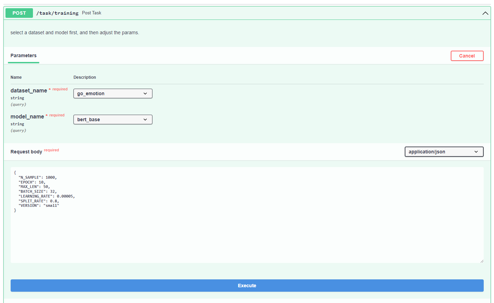
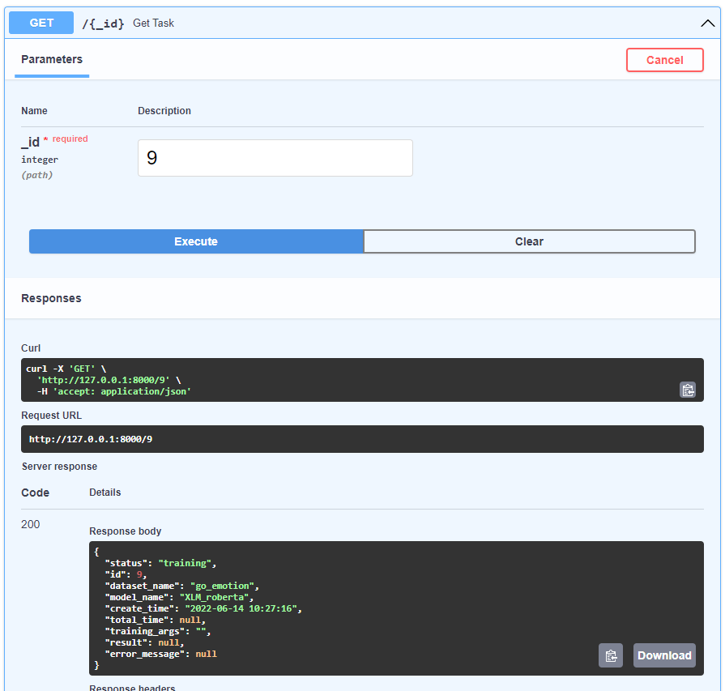
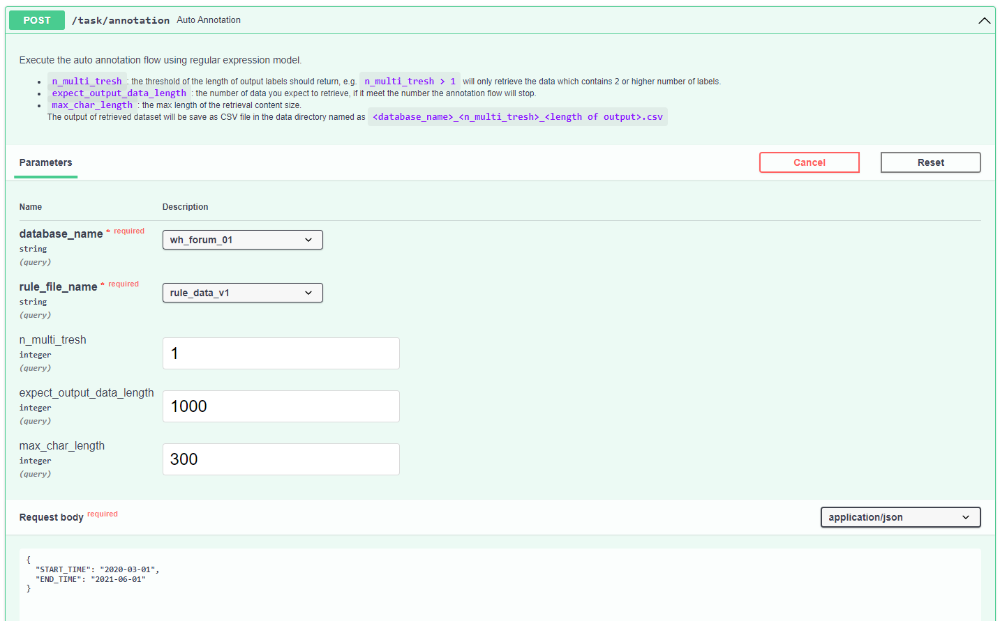
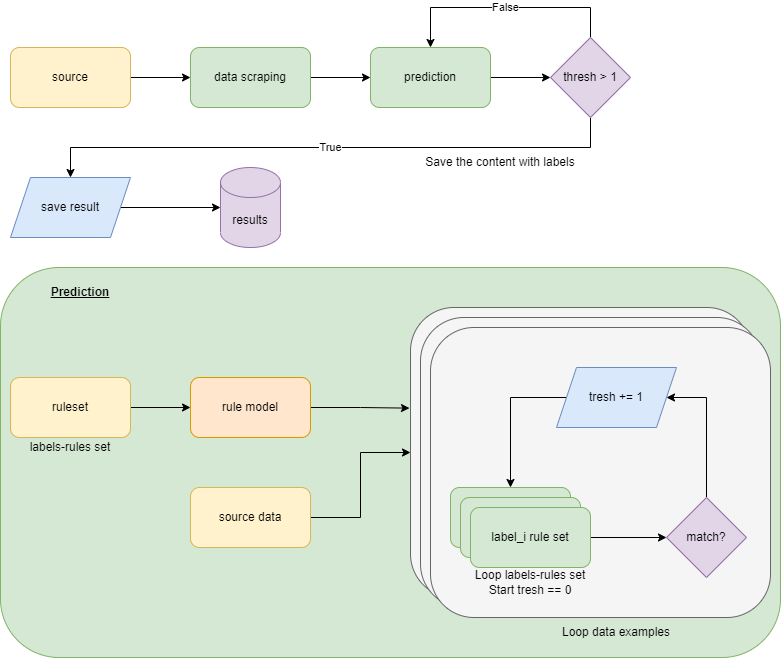

# Multi-Label Text Classification
###### created by Weber Huang 2022-05-23

**Table of Content**

1. [Overview](#overview)
   + [Requirements](#requirements)
   + [Usage](#usage)
2. [Workflow](#workflow)
3. [Datasets](#datasets)
4. [Models](#models)
5. [Appendix](#appendix)

## Overview

This is a project for text multi-label text classification implementation.

### Requirements

+ [Celery](https://docs.celeryq.dev/en/stable/index.html)
+ [FastAPI](https://fastapi.tiangolo.com/)
+ [Huggingface Transformers](https://huggingface.co/docs/transformers/index)
+ [Poetry 1.1.13](https://python-poetry.org/docs/)

+ [Python 3.8.10](https://www.python.org/downloads/release/python-3810/)
+ [Pytorch](https://pytorch.org/)
+ [Sqlmodel](https://sqlmodel.tiangolo.com/)

### Usage

Download and setup the environment:

```shell
$ git clone https://gitting.eland.com.tw/rd2/models/multi-label-classification.git
$ cd <project directory>
$ poetry install
```

Create a `.env` file

+ By default, the debug environment (`DEBUG=TRUE`) is using the sqlite database to store the training information, you can switch to other mysql or postgresql database. Try to modify the `settings.py` to change the configuration.

```bash
#Basic configuration
DEBUG=TRUE

#Training device configuration
DEVICE=cpu

#DATABASE: using mysql
USER=<user>
PASSWORD=<password>
HOST=<host>
PORT=<port>
SCHEMA=<schema>

#Auto-annotating source database configuration
A_USER=<user>
A_PASSWORD=<password>
A_HOST=<host>
A_PORT=<port>
```

Run the service

+ You can modify the celery command in `Makefile`, since we use cpu device configuration as default, the pooling command of celery worker is set to `solo`.

```bash
$ make run_api
$ make run_celery
```

Access the experimental docs of swagger user interface and start the experiment by http://127.0.0.1:8000/docs

### API

+ `training`
  + select <u>dataset and model</u>
  + adjust the training args in the request body
    + noted that `VERSION` means the different types of preprocessing strategy, see <u>dataset part</u> in **Appendix** for more details.
  + execute the training task
  + in the response body, it will return the **task_id**



+ `get_task`



+ `annotation`
  + choose the database and rule_file version
  + determine the multi threshold and expect output lenght
  + choose the content length limit
  + modify the start and end date
  + execute the flow
    + the output data will be save in `data` directory named as `<database_name>_<n_multi_tresh>_<output size>.csv`
  + Noted that you can modify `EXCLUDE_WORDS` in the `settings.py` to determine what data you want to exclude according to words




## Workflow


+ The model worker will select the data preprocessing and model class by the input arguments.
+ You can add new model class and data preprocess flow in this project.

## Datasets

| Name                | Description                       | Size (row)               | Source      | Link                                                       |
| ------------------- | --------------------------------- | ------------------------ | ----------- | ---------------------------------------------------------- |
| go_emotions         | emotions data from reddit comment | 43.41k / 5.426k / 5,427k | Huggingface | [go emotions](https://huggingface.co/datasets/go_emotions) |
| Audience Tiny (AT)  | Chinese datasetset                | 0.45k                    | manual      |                                                            |
| Audience Small (AS) | Chinese datasetset                | 2k                       | manual      | under annotation                                           |
| Audience Large (AL) | Chinese datasetset                | 10k                      | manual      | under annotation                                           |

+ Download the **go_emotion** via Python `datasets` package: 

  ```Python
  from datasets import load_dataset
  
  dataset = load_dataset("go_emotions")
  ```

+ **Audience DL multi-label** 為自主標註之中文多標籤多類別任務資料集
  + 預期依據資料筆數分別標註 500 / 2k / 10k 三份資料集
  + 使用<u>規則 (正則表達式) 模型</u>先行自動收集相關結果
  + 再使用 <u>doccano</u> 平台進行標註驗證
  + 詳情參考 <u>Appendix: Chinese data annotation</u> 流程


## Models

| Name                    | note                                                         |
| ----------------------- | ------------------------------------------------------------ |
| Random Forest           | The best **Baseline model** with <u>[classifier chain](https://en.wikipedia.org/wiki/Classifier_chains)</u> |
| aLBERT                  | [docs](https://huggingface.co/albert-base-v2)                |
| BERT                    | [docs](https://huggingface.co/bert-base-uncased)             |
| roBERTa                 | [docs](https://huggingface.co/roberta-base)                  |
| XLNet                   | [docs](https://huggingface.co/xlnet-base-cased)              |
| XLM-roBERTa             | [docs](https://huggingface.co/xlm-roberta-base)              |
| chinese-bert-wwm-ext    | [docs](https://huggingface.co/hfl/chinese-bert-wwm-ext)      |
| chinese-macbert-base    | [docs](https://huggingface.co/hfl/chinese-macbert-base)      |
| chinese-roberta-wwm-ext | [docs](https://huggingface.co/hfl/chinese-roberta-wwm-ext)   |


## Appendix

### Chinese data annotation

+ Auto-labeling flow



+  upload result dataset to [rd2demo doccano](https://rd2demo.eland.com.tw/) platform to manually validate the dataset.

###### Problems and Discussions

+ Too many spam or advertisement content inside the retrieval dataset:
  + maybe adding the spam classifier to filter the data before performing the rule prediction will better?

### How to add a dataset?

By default, we use [datasets](https://github.com/huggingface/datasets) package to load dataset from [huggingface datasets](https://huggingface.co/datasets), while you can manually add datasets with preprocessing from your own by adding:

```python
# utils/eum_helper.py 
...
class DatasetName(str, Enum):
    go_emotion = "go_emotion"
    """add your dataset name here"""
```

 ```python
 # preprocessing/raw_data_preprocess/preprocess.py
 def build_dataset(...):
     if dataset_name == DatasetName.go_emotion.value:
         ...
     elif dataset_name == <what you have added in the last step>:
         """your preprocessing here, make sure returns the dataloader class"""
     ...
     
 ```

### How to add a model?

We use the [transformers](https://huggingface.co/docs/transformers/index) models and classification tools, you can add the tokenizer and classification by modify `build_tokenizer` in the module `tokenizers_class.tokenize` and `BertModelWorker.create_model_class` in the module`wokers.models_builder.builder`.

### Experiment

###### Dataset

+ go_emotion
  + dataset preprocessing with `*` which indicated `"VERSION"="small"` in the parameter of post task, otherwise use `"VERSION"="origin"`


| Name          | Description                                                  | length |
| ------------- | ------------------------------------------------------------ | ------ |
| go_emotions   | raw dataset without any preprocess, only remove the duplicated row based on text | 57732  |
| go_emotions_s | small dataset with size 1000 rows sampling                   | 1000   |
| *             | only extract top 8 occurrence of label classes (original size of label classes is 28) | -      |
| AT            | `audience tiny` dataset annotated by auto-annotation flow and validated with doccano | 450    |
| AS            | `audience small` dataset annotated by auto-annotation flow and validated with doccano | 1200   |
| *             | in audience datasets, only select four classes (male, female, married and unmarried) | -      |


###### Baseline

+ metrics: accuracy and f1_score

| Name      | dataset     | method                   | accuracy                                                     |
| --------- | ----------- | ------------------------ | ------------------------------------------------------------ |
| RF        | go_emotions |                          | acc: 95.7194 <br />micro avg 17.667207 <br />macro avg 10.599551 <br />weighted avg 14.287957 |
| kNN       | go_emotions |                          | acc: 95.7184 <br />micro avg 16.128085 <br />macro avg 9.279948 <br />weighted avg 13.678768 |
| RF        | go_emotions | sklearn multi output     | acc: 95.7370 <br />micro avg 17.362550 <br />macro avg 10.471720 <br />weighted avg 13.940626 |
| LinearSVC | go_emotions | sklearn multi output     | acc: 95.9625 <br />micro avg 14.273205 <br />macro avg 8.714187 <br />weighted avg 10.206662 |
| LR        | go_emotions | sklearn multi output     | acc: 95.9509 <br />micro avg 14.033272 <br />macro avg 9.029469 <br />weighted avg 10.311118 |
| RF        | go_emotions | sklearn classifier chain | acc: 94.6698<br/>micro avg 32.595297<br/>macro avg 13.468366<br/>weighted avg 23.166349 |
| LinearSVC | go_emotions | sklearn classifier chain | acc: 94.7122<br/>micro avg 32.461811<br/>macro avg 10.715990<br/>weighted avg 20.726128 |
| LR        | go_emotions | sklearn classifier chain | acc: 94.73414<br/>micro avg 32.733890<br/>macro avg 11.458806<br/>weighted avg 21.258039 |


###### BERT

+ metrics: precision, recall and f1_score ("weighted")

| Name        | dataset        | params                                               | best_accuracy                                                |
| ----------- | -------------- | ---------------------------------------------------- | ------------------------------------------------------------ |
| bert-base   | go_emotions_s* | epoch: 10<br/>batch_size: 32<br/>learning_rate: 5e-5 | training acc {'precision': 86.39340162318044, 'recall': 62.52927400468384, 'f1': 68.35319614875736}<br/>validation acc {'precision': 63.61616021620872, 'recall': 40.09216589861751, 'f1': 47.05389188894794} |
| bert-base   | go_emotions*   | epoch: 10<br/>batch_size: 32<br/>learning_rate: 2e-5 | training acc {'precision': 39.40596096028193, 'recall': 36.651328551450355, 'f1': 37.50781298254313}<br />validation acc {'precision': 38.21967528121705, 'recall': 37.83808150018031, 'f1': 37.54336755696961} |
| XLNet       | go_emotions_s* |                                                      |                                                              |
| XLNet       | go_emotions*   | epoch: 10<br/>batch_size: 32<br/>learning_rate: 2e-5 | training acc {'precision': 76.85732008788638, 'recall': 64.99875866115964, 'f1': 69.97375070585639} <br />validation acc {'precision': 57.67942807383343, 'recall': 48.61048655454627, 'f1': 51.77189487135191} |
| roBERTa     | go_emotions_s* |                                                      |                                                              |
| roBERTa     | go_emotions*   | epoch: 10<br/>batch_size: 32<br/>learning_rate: 2e-5 | training acc {'precision': 74.77325531996433, 'recall': 60.615704064820456, 'f1': 66.24626030848755}<br/>validation acc {'precision': 58.86018961681455, 'recall': 50.12141379620469, 'f1': 53.595712428351064} |
| albert      | go_emotions_s* |                                                      | training acc {'precision': 20.214552022786744, 'recall': 11.866359447004609, 'f1': 14.954259674849673} <br />validation acc {'precision': 20.23673157693776, 'recall': 28.04232804232804, 'f1': 23.50853847859836} |
| albert      | go_emotions*   | epoch: 10<br/>batch_size: 32<br/>learning_rate: 2e-5 | training acc {'precision': 72.22155325328706, 'recall': 54.35060708755077, 'f1': 60.4297194540337}<br/>validation acc {'precision': 61.19612989692362, 'recall': 47.48366915079584, 'f1': 52.04388747079438} |
| XLM-roBERTa | go_emotions_s* | epoch: 10<br/>batch_size: 32<br/>learning_rate: 5e-5 |                                                              |
| XLM-roBERTa | go_emotions*   | epoch: 10<br/>batch_size: 32<br/>learning_rate: 2e-5 | training acc {'precision': 70.50961824008468, 'recall': 53.79626096909577, 'f1': 59.43265011622799}<br/>validation acc {'precision': 59.80590794913827, 'recall': 48.25650933848561, 'f1': 52.654950536253175} |

###### BERT with audience dataset

See `wandb` to track each run's details: [Audience_bert](https://wandb.ai/weber12321/audience_bert?workspace=user-weber12321)

| model                           | epoch | batch | learning rate | max_len | f1 score (%) | dataset | Notes     |
| ------------------------------- | ----- | ----- | ------------- | ------- | ------------ | ------- | --------- |
| bert-base-uncased               | 50    | 64    | 2e-5          | 30      | 54           | AT      |           |
| bert-base-chinese               | 50    | 64    | 2e-5          | 30      | 79.1         | AT      |           |
| albert-base-v2                  | 50    | 64    | 2e-5          | 30      | 31           | AT      |           |
| roberta-base                    | 50    | 64    | 2e-5          | 30      | 46           | AT      |           |
| xlm-roberta-base                | 50    | 64    | 2e-5          | 30      | 78.7         | AT      |           |
| **hfl/chinese-bert-wwm-ext**    | 50    | 64    | 2e-5          | 30      | **79.1**     | AT      |           |
| **hfl/chinese-macbert-base**    | 50    | 64    | 2e-5          | 30      | **79.4**     | AT      |           |
| **hfl/chinese-roberta-wwm-ext** | 50    | 64    | 2e-5          | 30      | **79.7**     | AT      |           |
| bert-base-chinese               | 50    | 64    | 2e-5          | 30      | 88.1         | AS*     |           |
| bert-base-chinese               | 50    | 32    | 2e-5          | 64      | 92           | AS*     |           |
| bert-base-chinese               | 50    | 32    | 2e-5          | 64      | 90.2         | AS*     | 5-fold CV |
|                                 |       |       |               |         |              |         |           |
